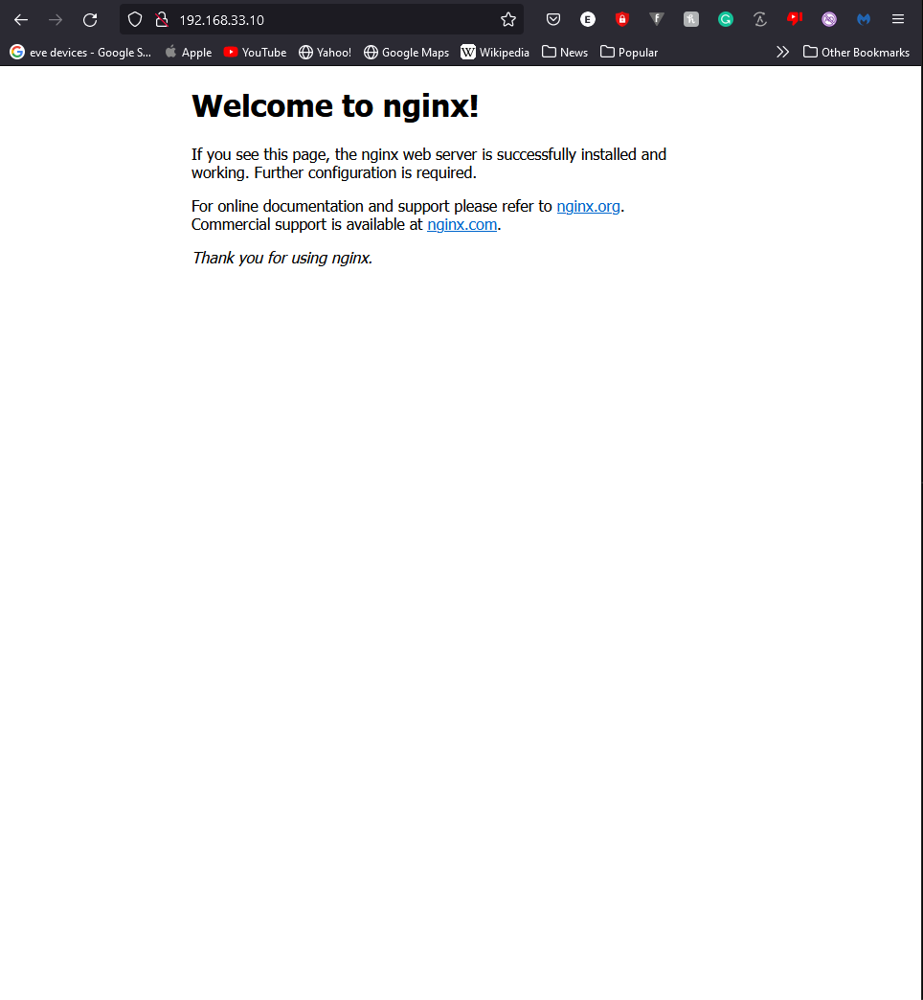
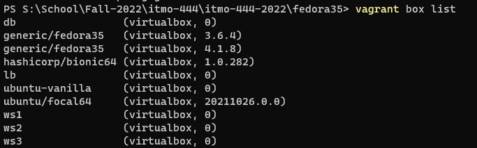

# Tooling Assignment Vagrant

Provide the required screenshots to show that tooling has been properly installed

## WebServer Install

Screenshot from the host OS of http://192.168.33.10



## Output of vagrant box list command

After completing this assignment take a screenshot, power off your vagrant box, and take a screenshot of the output of the command ```vagrant box list``` and insert it here.


## Deliverable

In the document, tooling-assignment-advanced-template.md, provide the required screenshots. Push a copy of this Markdown file in the private GitHub repo provided, under the your itmo-444 or itmo-544 folder and make an additional sub-folder named: **tooling-assignment-vagrant**.  Submit the URL to your document in the GitHub repo to Blackboard
