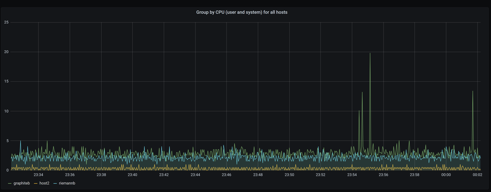

# ITMO 453/553 MP1

This document describes the requirements for MP1

## Objectives and Outcomes

* Demonstrate the ability to deploy a multi-node virtualized infrastructure
* Demonstrate the ability to configure services through automation
* Demonstrate the ability collect and route events
* Demonstrate the ability to graph routed events

### Project Outline

This project will require you to build a variable number of virtual machines depending on Graduate or Undergraduate status.

Graduates will need to create 8 virtual machines: riemanna, riemannb, riemannmc, graphitea, graphiteb, graphitemc, host1, and host2

Undergraduates will need to create 5 virtual machines: riemanna, riemannmc, graphitea, graphitemc, host1

Your virtual machines need to be built using a packer build script and using a provisioner script that will deploy and configure all requirements so that you are able to access the Grafana graphs and see results.  

#### Riemanna Requirements

* Using Ubuntu 20.04, install Riemann and all dependencies.  
* Install Collectd and the default plugins provided in week-12 sample code folder for Riemann
* Configure the write_riemann.conf collectd plugin to send metrics to Riemanna
  * Change the nodename in the write_riemann.conf to riemanna
* Configure Riemann to send events down stream to Riemannmc
* Configure the Graphite.clj plugin to send **tagged** collectd metrics to graphitea
* Configure the Firewall (firewalld to open only the needed ports, 22, 5555,5556, and 5557)

#### Riemannb Requirements

* Using RockyLinux, install Riemann and all dependencies.  
* Install Collectd and the default plugins provided in week-12 sample code folder for Riemann
* Configure the write_riemann.conf collectd plugin to send metrics to Riemannb
  * Change the nodename in the write_riemann.conf to riemannb
* Configure Riemann to send events down stream to Riemannmc
* Configure the Graphite.clj plugin to send **tagged** collectd metrics to graphiteb
* Configure the Firewall (firewalld to open only the needed ports, 22, 5555,5556, and 5557)

#### Riemannmc Requirements

* Using Ubuntu 20.04, install Riemann and all dependencies.  
* Install Collectd and the default plugins provided in week-12 sample code folder for Riemann
* Configure the write_riemann.conf collectd plugin to send metrics to Riemannmc
  * Change the nodename in the write_riemann.conf to riemannmc
* Configure Riemann to send events down stream to Riemannmc
* Configure the Graphite.clj plugin to send **tagged** collectd metrics to graphitemc
* Configure the Firewall (firewalld to open only the needed ports, 22, 5555,5556, and 5557)
* Configure the Email.clj plugin to send an email if either riemanna or riemmanb service stops sending metrics (you can test this by stopping the Riemann service on Riemanna or Riemannb -- generating a fault).

#### Graphitea Requirements

* Using Ubuntu 20.04, install the required graphite-carbon, whisper, graphite-api, gunicorn, and grafana 7.3.6
  * https://dl.grafana.com/oss/release/grafana_7.3.6_amd64.deb
* Install Collectd and the default plugins in the week-12 sample code folder for Graphite (includes the carbon process monitor)
* Configure the write_riemann.conf collectd plugin to send metrics to Riemanna
  * Change the nodename in the write_riemann.conf to graphitea
* Configure carbon.conf Relay Line Receiver and Pickle interface to listen on the systems public IP address
* Overwrite the default files using the graphite configuration files provided in week-09 folder
* Stop the default carbon-cache and carbon-relay@1 services and overwrite them with the default services files provided in the week-09/services directory
* Enable all services on boot

#### Graphiteb Requirements

* Using Ubuntu 20.04, install the required graphite-carbon, whisper, graphite-api, gunicorn, and grafana 7.3.6
  * https://dl.grafana.com/oss/release/grafana_7.3.6_amd64.deb
* Install Collectd and the default plugins in the week-12 sample code folder for Graphite (includes the carbon process monitor)
* Configure the write_riemann.conf collectd plugin to send metrics to Riemannb
  * Change the nodename in the write_riemann.conf to graphiteb
* Configure carbon.conf Relay Line Receiver and Pickle interface to listen on the systems public IP address
* Overwrite the default files using the graphite configuration files provided in week-09 folder
* Stop the default carbon-cache and carbon-relay@1 services and overwrite them with the default services files provided in the week-09/services directory
* Enable all services on boot

#### Graphitemc Requirements

* Using Ubuntu 20.04, install the required graphite-carbon, whisper, graphite-api, gunicorn, and grafana 7.3.6
  * https://dl.grafana.com/oss/release/grafana_7.3.6_amd64.deb
* Install Collectd and the default plugins in the week-12 sample code folder for Graphite (includes the carbon process monitor)
* Configure the write_riemann.conf collectd plugin to send metrics to Riemannmc
  * Change the nodename in the write_riemann.conf to graphitemc
* Configure carbon.conf Relay Line Receiver and Pickle interface to listen on the systems public IP address
* Overwrite the default files using the graphite configuration files provided in week-09 folder
* Stop the default carbon-cache and carbon-relay@1 services and overwrite them with the default services files provided in the week-09/services directory
* Enable all services on boot

#### Host1

* Using RockyLinux, install Collectd and the Collectd plugins from week-12 (from the riemann folder in the sample code)
* Configure the write_riemann.conf collectd plugin to send metrics to Riemanna
* Note you will need to install the `epel-release` plugin and then on a separate line the `collectd-write_riemann` package via `yum`
* Change the nodename in the write_riemann.conf to host1
* **No** need to install Riemann
* You can use the IP 192.168.33.10

#### Host2

* Using RockyLinux, install Collectd and the Collectd plugins from week-12 (from the riemann folder in the sample code)
* Configure the write_riemann.conf collectd plugin to send metrics to Riemannb
* Note you will need to install the `epel-release` plugin and then on a separate line the `collectd-write_riemann` package via `yum`
* Change the nodename in the write_riemann.conf to host2
* **No** need to install Riemann
* You can use the IP 192.168.33.11

### Graphs for Grafana

* On all Graphite systems the datasource and Dashboards/Panels can be manually configured, configure a datasource to connect to the corresponding graphite-api endpoint.
* Configure 3 Dashboards, one for each Production region

**Graphite A**

**Graphite B**

**Graphite MC**

* In each dashboard create the following panels:
  ## Graphite A
  * Reimann streams latency
  
  * Carbon Process
  
  * Collectd process
  
  * Group by CPU (user and system) for all hosts
  
  * Alias by Memory (used) all hosts
  
  * Alias by Disk used (df root_percent bytes)
  

  ## Graphite B
  * Reimann streams latency
  
  * Carbon Process
  
  * Collectd process
  
  * Group by CPU (user and system) for all hosts
  
  * Alias by Memory (used) all hosts
  
  * Alias by Disk used (df root_percent bytes)
  

  ## Graphite MC
  * Reimann streams latency
  
  * Carbon Process
  
  * Collectd process
  
  * Group by CPU (user and system) for all hosts
  
  * Alias by Memory (used) all hosts
  
  * Alias by Disk used (df root_percent bytes)
  

* Once all charts are created use the **export** feature in Grafana to export your graphs into json format -- only 1 system is needed graphitea.  Include these json files in your mp1 folder.

* -1638243286303.json)
* -1638243534468.json)
* -1638465785467.json)
## Deliverable

Create a folder named mp1 into your GitHub class repo.  Copy this mp1.md template into the folder.  Added screenshots of all the bullet point graphs in the previous section and add those screenshots to your mp1.md document.   Submit the URL to your MP1 document to Blackboard.