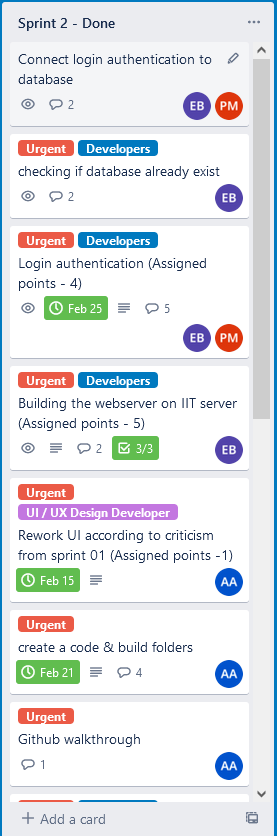
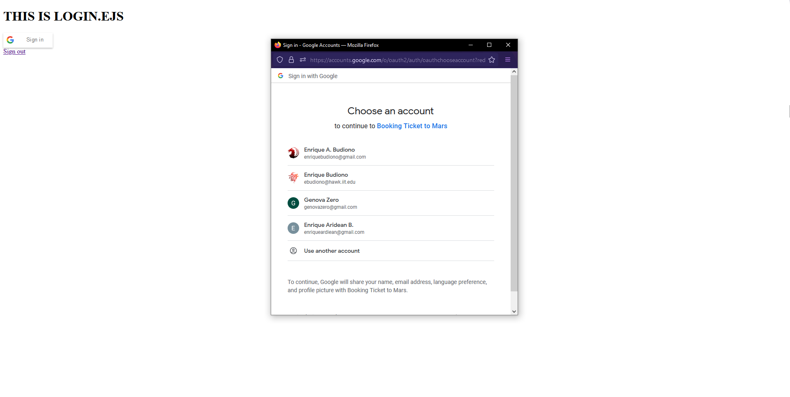
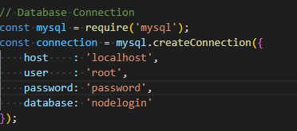
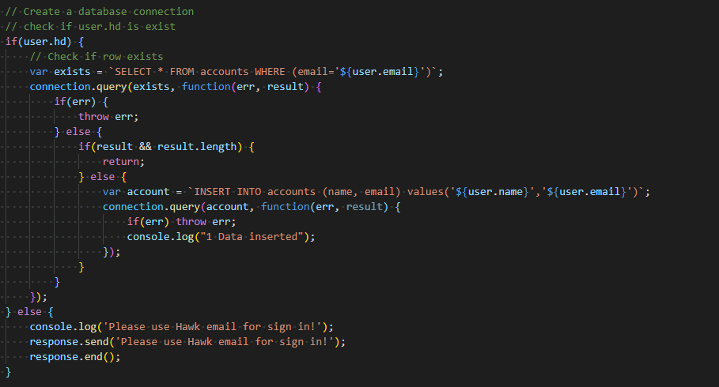
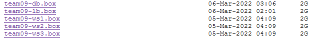

# Sprint-02
## Self-Critique
* Roles:
    * Assingned by the team leader ([John Hernandez](https://github.com/johnhdez105)) where he assign me as a developer 2 together with ([Priyank Mithapara](https://github.com/pmithapara)) where we create the page and the script for the webpage of the project.
* Jobs:
    1.  Adding code inside the [code folder](https://github.com/illinoistech-itm/2022-team09w/tree/main/code) 
    2.  Creating the Node.Js for the main part of the web page
    3.  Creating connection with database where it connect the login system
    4.  Creating the Google Authentication for the login side.
    5.  Creating the welcome page and the dashboard / main part using EJS
* Screenshot:
    ### Trello
    

    ### Googe Authentication (ONLY HAWK email)
    
* Detail the work that accomplished and delivered:
    * Making connection between the app and the database using MySQL

    
    * Creating the [server.js](https://github.com/illinoistech-itm/2022-team09w/blob/main/code/server.js)
    * Creating [welcome.ejs](https://github.com/illinoistech-itm/2022-team09w/blob/main/code/views/welcome.ejs), [login.ejs](https://github.com/illinoistech-itm/2022-team09w/blob/main/code/views/login.ejs), and [dashboard.ejs](https://github.com/illinoistech-itm/2022-team09w/blob/main/code/views/dashboard.ejs) file
    * Google authentication where only HAWK email allowed
    
    * Creating 5 box file with basic requirement on the automation
    
* Self-Critique what I did and what you have gone better:
    * During the Sprint 02, I think I almost did everything on the backend by myself where it could impact the team performance that make the other member not do anything or contribute anything to the project. In the next sprint, I think I should let the other member work to by dividing the work equally so they could contribute it to github without leave them hanging around.

## Group-Critique

1. Priyank Mithapara:
    * Critique: For sprint 02, Priyank is really helpful when dealing with ideas, improvement  for compact.md and how can the team leader seperate the work for the other member.

    * Contributions: Helping the developer 2 on how the website going to be looks like and also splitting the task where I create the dependencies and the server.js file where he will do the HTML and CSS.

    * Improvements: For sprint 02, I think Priyank already give his best for this sprint

2. John Hernandez:
    * Critique: For sprint 02, John only active in the first week of week 02 where he assigned the group project roles and what are we going to do. However, after the first week, John seems to be lost contact a little bit. 

    * Contributions: Re-creating the logo for the website to make it better and not a drawing sketch, giving a task for each team member what we should do each week

    * Improvements: For sprint 02, I think John should be more contributing when developing the app where right now he does not seems to push anything to github and only make changes on the readme.md on the first week of sprint 02.

3. Ayobami Adebowale:
    * Critique: The communication that she did with the teammate is still not improving and she still does not know how to use github repo or visual studio code.

    * Contributions: Recreate the design for the web page where she recreate it from the critique that professor Hajek gave to our group

    * Improvements: Improve her communication with teammate to make her teammate know what the progress on her task so the other could continue the work of the project.