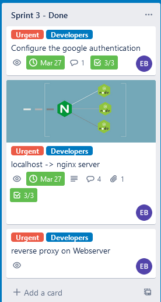
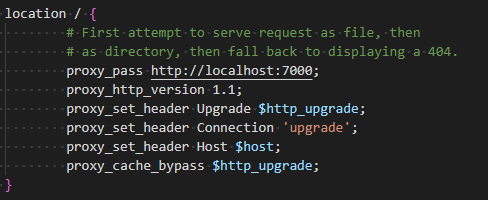
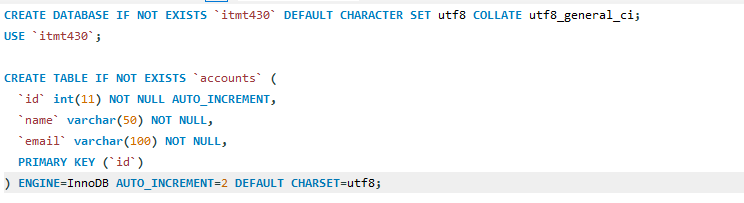

# Sprint-03
## Self-Critique
* Roles:
    * Assingned by the team leader ([Priyank Mithapara](https://github.com/pmithapara)) where he assign me as a IT Orchestration and security and also a developer for Backend of the app. Also, he assigned me for building and editing the automation of the boxes that the team going to use.
* Jobs:
    1. Adding the nodeJs server / webserver into NGINX using reverse proxy
    2. Creating database on the [database server](https://github.com/illinoistech-itm/2022-team09w/tree/main/build/project/db)
    3. Connecting the database server into Webservers (1,2, & 3)
    4. Fixing the google authentication after implementing to webserver

* Screenshot:
    ### Trello
    

* Detail the work that accomplished and delivered:

    * Reverse proxy on NGINX for each webserver

    
    * Creating database

    

* Self-Critique what I did and what you have gone better:
    * Making sure that all documentation that I made in [readme.md](https://github.com/illinoistech-itm/2022-team09w/blob/main/code/readme.md) inside the code folder is clear enough so my teammate could run it without getting any problem. Because, right now, some of my teammate still does not know how to access the webeserver that we developing until now.

## Group-Critique

1. Priyank Mithapara:
    * Critique: For sprint 03, Priyank is really helpful when dealing with ideas, improvement of the website / the front end using EJS and how can the team leader seperate the work for the other member.

    * Contributions: Helping the developer 2 & 3 on how the website going to be looks like and also splitting the task where I create the dependencies and the server.js file where he will do the HTML and CSS. Also, leading the team so everyone have something to work on.

    * Improvements: For sprint 03, I think Priyank already give his best for this sprint
2. John Hernandez:
    * Critique: Lack of communication between teammate and the leader of the sprint where it could lead us, the team, confused on what we should improve next.

    * Contributions: Helping the front-end developer [Priyank Mithapara](https://github.com/pmithapara) on how the server should be look like.

    * Improvements: More communication between teammate and more active on the chat where sometimes he seems to be missing when the leader asking him about something.

3. Ayobami Adebowale:
    * Critique: Lack of communication between team member who willing to help her on her problem regarding her laptop where it seems she always busy with something that make her teammate to be confused. Also, she start doing the task that she was assigned to her three days before the sprint.

    * Contributions: Editing the CSS and creating the Bios for each member of the team in [about us](https://github.com/illinoistech-itm/2022-team09w/blob/main/code/views/about-us.ejs) page.

    * Improvements: More communication between team member and more active on the chat where she seems to be missing when the leader asking her about something. Also, a nice information from her to the teammate when can she start her task.