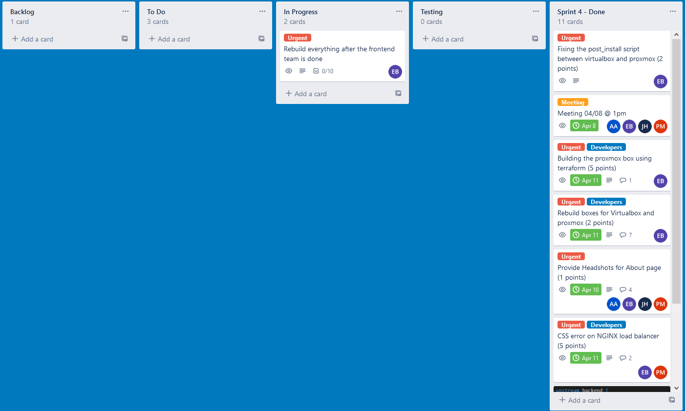
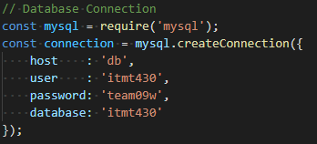
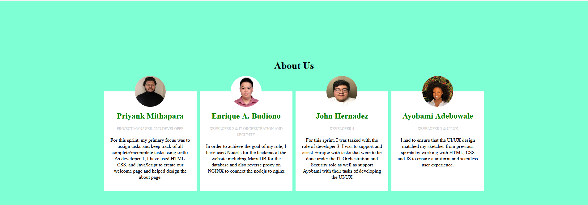
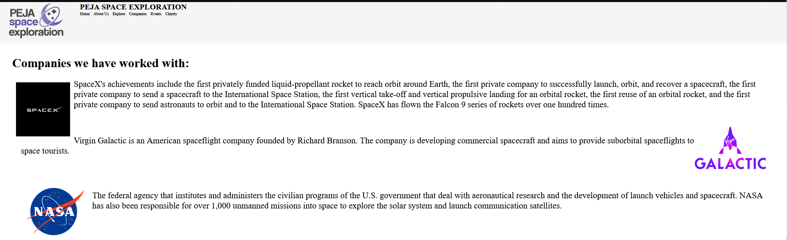

# Sprint-04
## Self-Critique
* Roles:
    * Assingned by the team leader ([Priyank Mithapara](https://github.com/pmithapara)) where he assign me as a IT Operations, IT Orchestration and security and also a developer for Backend of the app. Also, he assigned me for building and editing the automation of the boxes that the team going to use on both virtualbox and proxmox server.
* Jobs:
    1. Editing the [Server.js](https://github.com/illinoistech-itm/2022-team09w/blob/main/code/server.js) to be working with both virtualbox and proxmox server
    2. Fixing the database server to be working with both virtualbox and proxmox server
    3. Adding the google authentication for proxmox server
    4. Fixing CSS and NGINX error on both virtualbox and proxmox server
    5. Building boxes for proxmox server

* Screenshot:
    ### Trello
    

* Detail the work that accomplished and delivered:

    * Changing the reverse proxy on NGINX inside the load balancer to be working smoothly with each webservers.
    * Changing how the databases is hard coded to be working with both virtualbox and proxmox server.
    
    
    * Fixing the google authentication for proxmox server
    * Creating the proxmox server boxes using proxmonster4 and terraform

* Self-Critique what I did and what you have gone better:
    * Making sure that all documentation for this sprint is clear enough so my teammate could run it without getting any problem. Because, right now, some of my teammate still does not know how to access the website that we developing until now. Also, making sure everyone in the team know how to access the website from proxmox server.

## Group-Critique

1. Priyank Mithapara:
    * **Critique**: For sprint 04, Priyank is really helpful when dealing with ideas, improvement of the website / the front end using EJS and how can the team leader seperate the work for the other member.

    * **Contributions**: Being a team leader and creating the [about-us page](https://github.com/illinoistech-itm/2022-team09w/blob/main/code/views/about-us.ejs) for the team where he will include the information about the team members and the team name. Also, being the second eye for me when fixing the bugs on database on proxmox server.

    

    * **Improvements**: For sprint 04, I think Priyank already give his best for this sprint
2. John Hernandez:
    * **Critique**: No communication between the team and the team leader. But, giving a good result on the [companies page](https://github.com/illinoistech-itm/2022-team09w/blob/main/code/views/companies.ejs). Also giving some ideas how the the website should be looks like at the end of the sprint.
    * **Contributions**: Creating the [companies page](https://github.com/illinoistech-itm/2022-team09w/blob/main/code/views/companies.ejs)
    

    * **Improvements**: TBA

3. Ayobami Adebowale:
    * **Critique**: Lack of communication between team member who willing to help her on her problem regarding her laptop where it seems she always busy with something that make her teammate to be confused. Also, she start doing the task that she was assigned to her three days before the sprint.

    * **Contributions**: Nothing

    * **Improvements**: More communication between team member and more active on the chat where she seems to be missing when the leader asking her about something. Also, a nice information from her to the teammate when can she start her task.