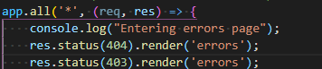
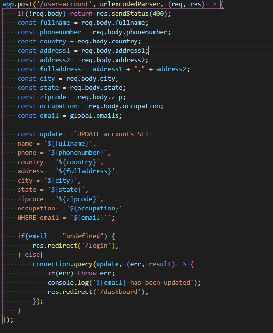
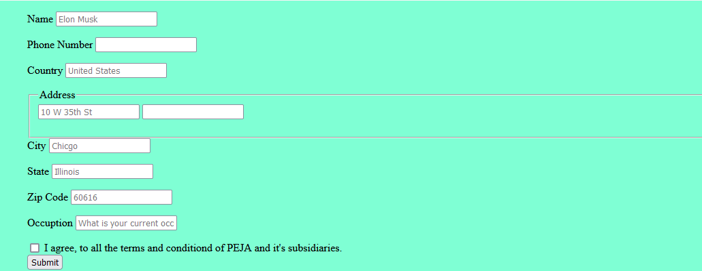

# Sprint-05
## Self-Critique
* Roles:
    * Assingned by ([Priyank Mithapara](https://github.com/pmithapara)) where he assign me as a IT Operations, IT Orchestration and security and also a developer for Backend of the app. Also, he assigned me for building and editing the automation of the boxes that the team going to use on both virtualbox and proxmox server.
* Jobs:
    1. Adding details to the front end of the website
    2. Adding the security to the website when getting 404 not found error.
    3. Adding the security to the website when getting 403 forbidden error.
    4. Adding databases connection to [user-account page](https://github.com/illinoistech-itm/2022-team09w/blob/main/code/views/user-account.ejs).

* Screenshot:
    ### Error Code
    

    ### User-Account Page
    
    

* Detail the work that accomplished and delivered:
    * Adding icons to the front end of the website on each page using:
    
    

    * Creating a condition where error code such as 404 and 403 error will be passed into [error page](https://github.com/illinoistech-itm/2022-team09w/blob/main/code/views/errors.ejs).
* Self-Critique what I did and what you have gone better:
    * Making sure that all team member know how to access the server without getting worried what IP should the enter when testing the website on virtualbox and proxmox server.

## Group-Critique

1. Priyank Mithapara:
    * **Critique**: For sprint 05, Priyank is really helpful when dealing with ideas, improvement of the website / the front end using EJS and how can the team leader seperate the work for the other member.

    * **Contributions**: Being a creating the [user-account page](https://github.com/illinoistech-itm/2022-team09w/blob/main/code/views/user-account.ejs) for the user of the website where the user could change their name or adding their bio data into the database to be more accurate. Also, helping the other team member how they should split the work for this sprint

    

    * **Improvements**: For sprint 05, I think Priyank already give his best for this sprint
2. John Hernandez:
    * **Critique**: No communication between the team and the team leader on the first week after sprint 04. Also giving some ideas how the the website should be looks like at the end of the sprint.

    * **Contributions**: Helping Developer 2 on the front end page (CSS + JS). Also making CSS for login page. And adding questions page with 50 questions in it.

    * **Improvements**: More communication between teammate and more active on the chat where sometimes he seems to be missing when the leader asking him about something.

3. Ayobami Adebowale:
    * **Critique**: Lack of communication between team members who willing to help her to solve the problem where she did not have her laptop because of some incident that happens in sprint 04. Assigning task to the other team member without knowing that the task already done in sprint 04.

    * **Contributions**: Nothing

    * **Improvements**: More communication between team member and more active on the chat where she seems to be missing when the leader asking her about something. Also, a nice information from her to the teammate when can she start her task.