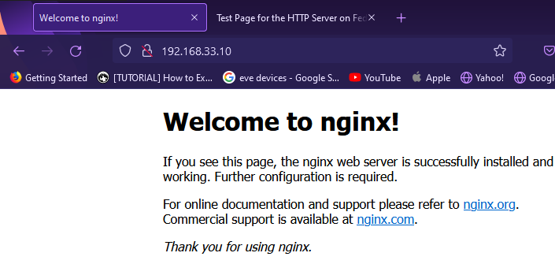
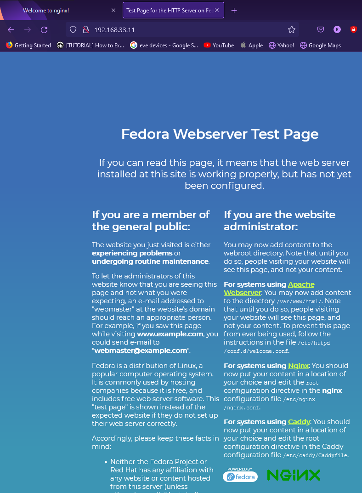
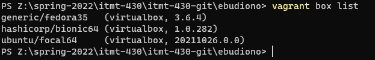

# Tooling Assignment Vagrant

Provide the required screenshots to show that tooling has been properly installed inside of your Ubuntu 20.04.3 Vagrant Box

## WebServer Install

Screenshot from the host OS of 

## Ubuntu Virtual Machine (http://192.168.33.10)


## Fedora Virtual Machine (http://192.168.33.11)


## Output of vagrant box list command

After completing this tutorial take a screenshot of the output of the command ```vagrant box list```

## Deliverable

In the document, tooling-assignment-advanced-template.md, provide the required screenshots. Push a copy of this Markdown file in the private GitHub repo provided, under the itmd-521 folder and make an additional sub-folder named: **tooling-assignment-vagrant**.  Submit the URL to your deliverable to Blackboard
